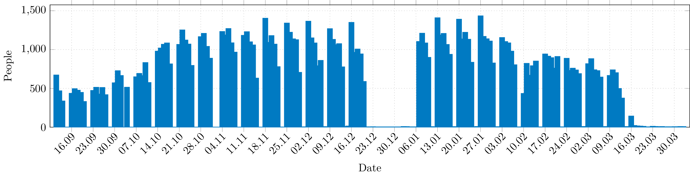
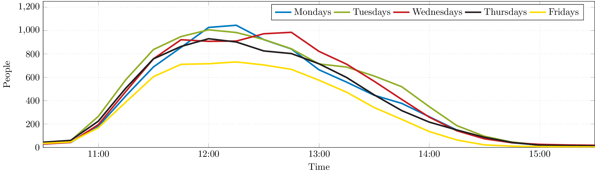
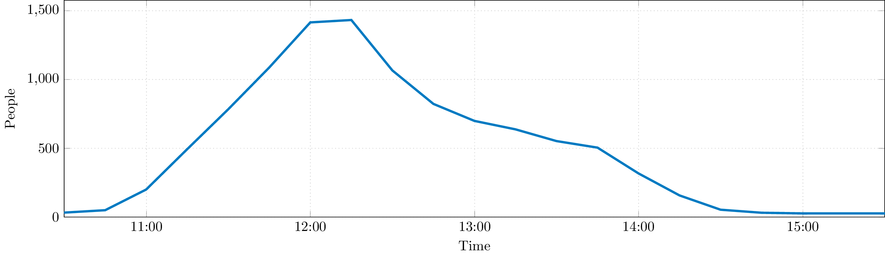

# Data source

[LRZ WiFi stats](http://wlan.lrz.de/apstat/) (Graphite), storage policy seems to be 5 minute buckets for the last 28 days and 15 minute buckets for at least several years.

Run [download-stats.sh](download-stats.sh) to download all stats since the grand opening on 9/11 2019.


# How many people are there at peak hours?

```bash
cargo run -- --mode overview --ap-stats ap-stats.json > overview.csv
cd tex
pdflatex overview.tex
```



This graph shows the maximum number of people in the Mensa at any given day.

# What's the best time for lunch?

```bash
cargo run -- --mode average --ap-stats ap-stats.json --since 2019-10-14 --until 2019-11-30 > average.csv
cd tex
pdflatex average.tex
```



Looks like 12:00 is the most popular time for lunch. The script filters days that seem to be holidays (Peak less than 10% of the median peak for that day).

# Check out a specific day

```bash
cargo run -- --mode single --ap-stats ap-stats.json --day 2019-11-18 > day.csv
cd tex
pdflatex single-day.tex
```



Traffic on the busiest day yet: Monday, November 18th, 2019.

Pro-tipp: Re-download the stats with a custom `from` parameter if you want to render a day that is less than 4 weeks ago. This gives you data with 5 minute granularity.

# What's happening before and after lunch?

Also check out the off-peak hours (by modifying `xmin`/`ymax` or look at the CSV).
The first shift of ~8 employees shows up at 6:00, followed by ~8 more people at 8:00. Almost all of them leave by 16:00.
The most popular SSID is `eduroam` during Mensa opening hours, `LRZ` and `BayernWLAN` are most used before and after.


# Wouldn't it be easier to just query Graphite?

Yes, but we want to print these graphs and PGFPlots is pretty!

# How many people are in the Mensa right now?

Check out this live view: [https://mensa.liste.party/](https://mensa.liste.party/)
